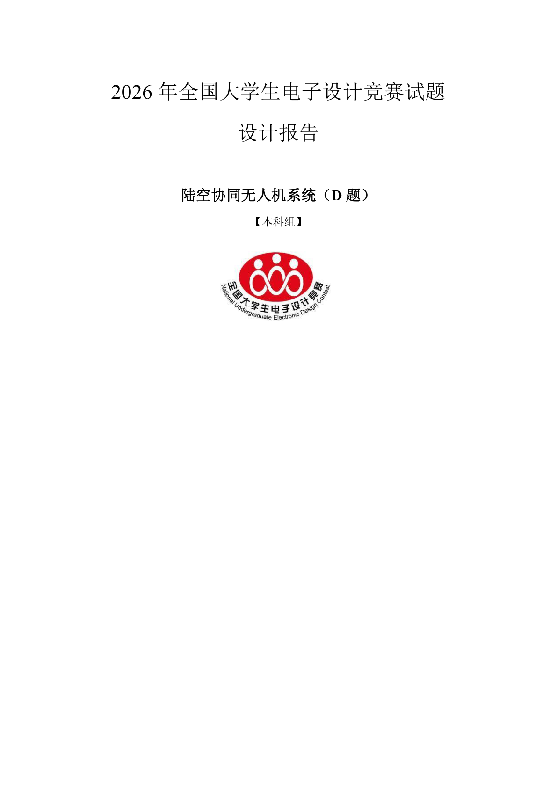
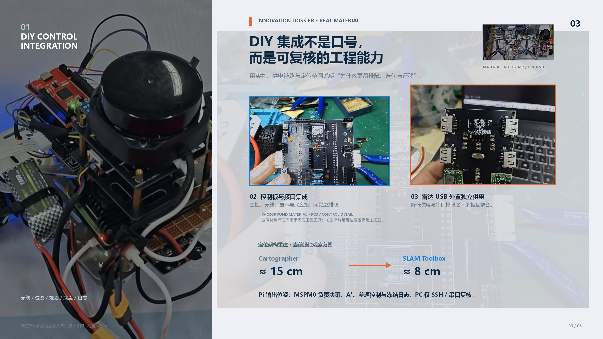

# Office Build

面向公开展示的 Codex Office 技能仓库，提供两条互不覆盖的生产链：**模板优先 Word 实验报告**与**逐页锁定 PowerPoint**。

本仓库发布通用技能逻辑、检查脚本和参考规则。除下方经用户明确批准、仅用于展示版式效果的两张预览图外，不包含用户模板、可编辑报告/PPT 成品、原始照片、日志或项目数据。

## 可用技能

| 技能 | 用途 | 交付边界 |
| --- | --- | --- |
| [`robot-report-suite`](skills/robot-report-suite/SKILL.md) | 基于指定 Word 模板创建、重构和修订 `.docx/.pdf` 实验报告、技术报告与竞赛报告 | 保留模板和基础信息页；不创建或修改 `.pptx`。 |
| [`technical-defense-ppt`](skills/technical-defense-ppt/SKILL.md) | 创建、改版、逐页审稿、渲染和交付答辩/项目汇报 `.pptx` | 不改写 Word 报告；报告仅作为可选只读输入。 |

不要使用报告转 PPT 桥接技能。若项目同时需要报告和 PPT，分别创建独立工作区；只能将另一侧的定稿副本作为只读资料。

## 效果展示

下列图片仅展示两条生产链的**版式、信息密度与视觉组织方式**：左图为模板优先报告的第一页封面预览，右图为证据型技术答辩页面。它们不是可编辑交付物，也不作为性能或验收结论的证据。

<p align="center">
  
  
</p>

## 标准工作流

### Word 实验报告

1. 复制原模板、原报告和格式要求到 `report-workspace/input/template/`，并锁定保留范围。
2. 将图片、日志、数据表、代码说明和文字资料放入 `input/fuel/`；建立可回链的证据台账。
3. 先形成章节卡片、图表清单和格式契约，再输出可审阅初版 `v0`。
4. 渲染检查基础信息页、空白、表格、图题和证据关系；依反馈输出 `v1`、`v2`……，不覆盖输入。
5. 用户需要图片效果展示时，仅从已通过质检的最终 PDF 派生 `showcase/vN/` 逐页 PNG 与联系表；不改写报告正文。默认不公开预览图；只有用户明确批准时，才可将脱敏/选定效果图放入 `assets/showcase/`。

### 技术答辩 PPT

1. 将原 PPT 放入 `ppt-workspace/input/original/`，将图片、数据、日志与文本放入 `input/fuel/`。
2. 建立资产台账，为每一页锁定结论、证据、Hero、Support、Finish、版式与讲解节拍。
3. 按页面锁定卡顺序构建并渲染 `v0`。
4. 先修正结论与证据，再修正阅读路径、裁切和版式；每轮输出版本化 `v1`、`v2`……。

## 使用方式

```powershell
git clone https://github.com/fangniuaijingua/office-biuld.git
Copy-Item -Recurse -Force .\office-biuld\skills\robot-report-suite "$env:USERPROFILE\.codex\skills\robot-report-suite"
Copy-Item -Recurse -Force .\office-biuld\skills\technical-defense-ppt "$env:USERPROFILE\.codex\skills\technical-defense-ppt"
```

完成后在 VS Code 执行 **Developer: Reload Window** 以刷新技能列表。

## 仓库结构

```text
skills/
  robot-report-suite/       # 模板保护、证据、图表与 DOCX/PDF 质检
  technical-defense-ppt/    # 资产、逐页锁定、渲染与 PPT 质检
SKILL.md                    # Office 技能目录与路由
```

提交到此公开仓库前，务必确认不含用户文档、原始照片、日志、账号信息、绝对本机路径或生成的交付物；`assets/showcase/` 中的明确授权展示图是唯一例外。
